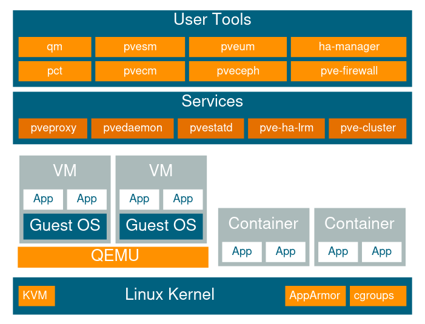

# Introduction

**Proxmox VE** est une **solution de virtualisation open source** de type **bare-metal**, développée par **Proxmox Server Solutions GmbH**. Elle repose sur l’hyperviseur **KVM (Kernel-based Virtual Machine)** pour la virtualisation complète, et sur **LXC (Linux Containers)** pour la virtualisation légère.

Distribuée sous **licence AGPLv3**, Proxmox VE est libre d’utilisation et propose un modèle de support commercial. Elle est fournie via une **image ISO bootable**, avec un installateur basé sur **Debian GNU/Linux**.

***

## Structure d'un hôte Proxmox VE

<figure><figcaption></figcaption></figure>

***

Les **outils utilisateurs** sont utilisés pour piloter manuellement les VMs, conteneurs, clusters, stockage, pare-feu, etc... tandis que les **services** automatisent les actions système, fournissent l'interface graphique, assurent le fonctionnement du cluster, le monitoring et la haute disponibilité.

### Outils utilisateurs (User Tools)

Ces outils en ligne de commande permettent aux administrateurs de gérer efficacement l’infrastructure Proxmox :

* **qm** : Gestion des machines virtuelles (VM). Permet de créer, démarrer, arrêter, cloner ou modifier des VMs.
* **pct** : Gestion des conteneurs (LXC). Similaire à qm, mais pour les containers.
* **pvesm** : Outil de gestion du stockage (Storage Manager). Permet d’ajouter, supprimer ou modifier des stockages.
* **pvecm** : Outil de gestion de cluster. Permet de créer ou rejoindre un cluster de nœuds Proxmox.
* **pveum** : Gestion des utilisateurs et des rôles (User Manager). Permet de créer des comptes, assigner des rôles et gérer les droits d'accès.
* **pveceph** : Outil de gestion du cluster Ceph pour le stockage distribué.
* **ha-manager** : Gestion de la haute disponibilité (HA). Supervise les ressources critiques et leur redémarrage automatique en cas de panne de nœud.
* **pve-firewall** : Outil de gestion du pare-feu intégré. Permet de définir des règles de filtrage au niveau hôte, VM ou container.

### Services Proxmox (Services)

Ces services tournent en arrière-plan pour faire fonctionner correctement l’écosystème Proxmox :

* **pveproxy** : Serveur web qui gère l’interface graphique (GUI) de Proxmox VE. Ecoute sur le port TCP/8006
* **pvedaemon** : Service principal de gestion des tâches système, comme le déploiement de VMs ou les opérations sur le cluster.
* **pvestatd** : Collecte et fournit des statistiques système et de monitoring (charge CPU, usage mémoire, etc.).
* **pve-ha-lrm** (Local Resource Manager) : Supervise localement les ressources HA d’un nœud.
* **pve-cluster** : Assure la synchronisation et la gestion des fichiers de configuration partagés via pmxcfs (le Proxmox Cluster File System).

***

## Fonctionnalités principales de Proxmox VE

### Interface de d'administration centralisée&#x20;

Proxmox VE est conçu pour évoluer d’un simple nœud à un **cluster haute disponibilité multi-nœuds**. Cette capacité est incluse par défaut, sans besoin d’outils tiers ou de serveurs de gestion coûteux.

* **Architecture multi-maître** : chaque nœud du cluster peut administrer l’ensemble du système, y compris les VMs, conteneurs, stockages et réseaux.
* **Interface Web intuitive** : l’administration se fait entièrement via une interface web moderne (ExtJS), avec accès aux journaux système, ressources (VM, conteneurs, stockages, ...)  tâches, migration à chaud, backups, etc., sur chaque nœud.
* **Ligne de commande et API REST** : pour les utilisateurs avancés, une CLI complète avec autocomplétion intelligente et documentation (man pages) est disponible, ainsi qu’une API RESTful définie en JSON Schema.
*   Administration basée sur les rôles et authentification :&#x20;

    La gestion des droits est **granulaire** et permet un contrôle précis sur l’accès aux objets (VM, stockage, nœuds...).

    * **Rôles et permissions (ACL)** : définissez des rôles avec des privilèges spécifiques, puis assignez-les à des utilisateurs ou groupes sur des objets précis.
    * **Réalms d’authentification multiples** : support de l’authentification locale, LDAP, Active Directory, Linux PAM ou via le serveur interne Proxmox.

### Stockage et clustering

Le modèle de stockage Proxmox est extrêmement **modulaire et évolutif. V**ous pouvez combiner autant de stockages que nécessaire, qu'ils soient locaux ou partagés.

* Proxmox Cluster File System (pmxcfs) : système de fichiers qui stocke les fichiers de configuration des machines. Ces données, dans un contexte de clustering sont répliquées en temps réel via Corosync sur tout les nœuds .&#x20;
* Stockages partagés compatibles : NFS, CIFS, iSCSI, Ceph, GlusterFS
* Stockages locaux compatibles : Repertoire classique sur système, LVM, LVM-Thin, ZFS

> La prise en charge du stockage partagé permet notamment la **migration à chaud** de VMs entre nœuds, sans interruption

### Sauvegarde et restauration intégrées

L’outil de sauvegarde intégré **vzdump** permet de **créer des snapshots cohérents** de VMs ou conteneurs, même à chaud.

* Supporte tous types de stockage (y compris NFS, CIFS, Ceph…)
* Nouveau format optimisé pour une écriture rapide, peu d’E/S, et support des fichiers creux (sparse)
* Peut être planifié et intégré au cluster ou au **Proxmox Backup Server** pour de la déduplication et des backups incrémentaux

### Réseau virtualisé avancé

Proxmox adopte un **modèle réseau en pont (bridge)** à la fois simple et flexible, dans lequel les interfaces réseau des machines virtuelles (VM) et des conteneurs (CT) sont connectées à des interfaces bridge, eux-mêmes reliés aux interfaces physiques du serveur hôte. Ce modèle permet : la **prise en charge complète des VLAN (802.1q)**, facilitant la segmentation réseau, ainsi que la **gestion de l’agrégation de liens (bonding)** pour une meilleure résilience et bande passante.

D'autre part, on a le **SDN (Software Defined Networking)** intégré depuis la version 8.1  qui  permet la gestion de réseaux virtuels complexes via l’interface web

### Infrastructure hyper-convergée (HCI)

Proxmox VE est une plateforme **hyper-convergée open source**, combinant calcul, stockage, réseau, sauvegarde et haute disponibilité dans une seule interface idéale pour les environnements distribués, bureaux distants ou clouds privés.

**Avantages :**

* **Évolutivité** : ajout de nœuds, stockage ou réseau à la volée
* **Réduction des coûts** : solution complète, libre, sans licence propriétaire
* **Simplicité d’administration** : tout est géré depuis l’interface centrale
* **Intégration ZFS et Ceph** : stockage distribué, redondant, et auto-géré
* **Haute disponibilité** : services HA natifs

***

## Communauté & support

* [📘 Wiki officiel](https://pve.proxmox.com/wiki/Main_Page)
* [💬 Forum communautaire](https://forum.proxmox.com/)
* 📬 [Listes de diffusion (users/dev)](https://lists.proxmox.com/)
* 🐞 [Bugtracker](https://bugzilla.proxmox.com/)
* 💼 Support commercial disponible via abonnement
